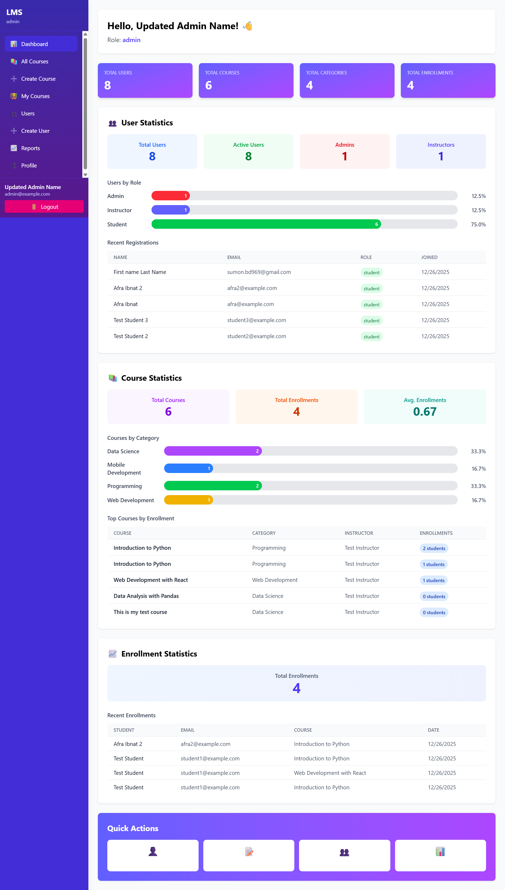
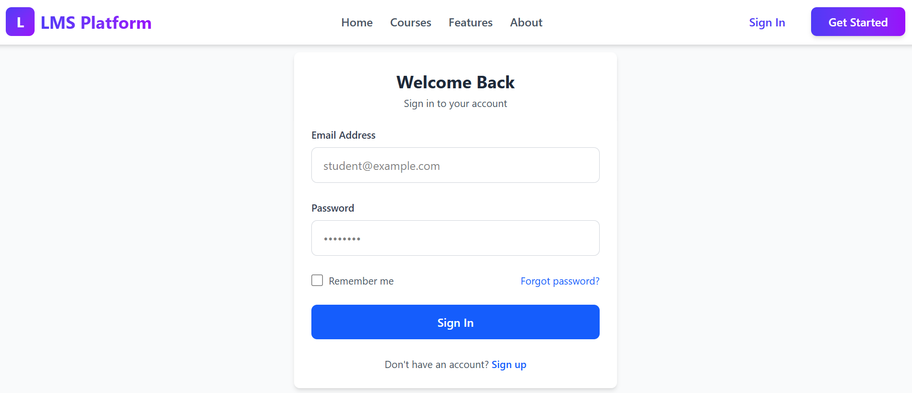
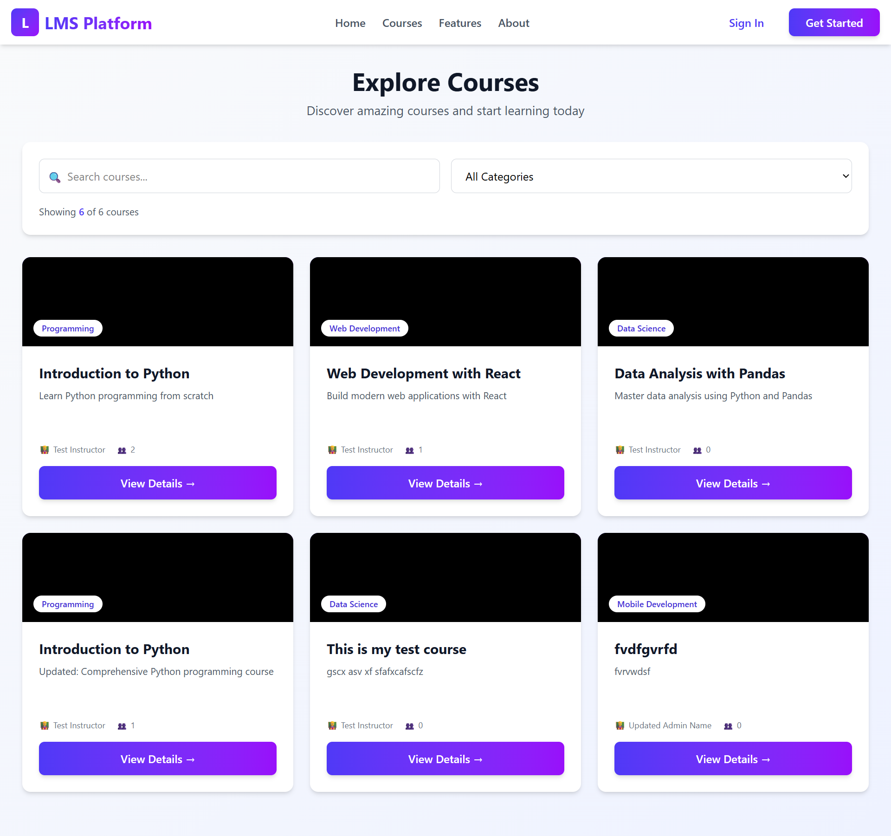

# Learning Management System (LMS)

## Project Overview

A full-stack Learning Management System built with Django REST Framework and React. This platform enables administrators to manage users and courses, instructors to create and manage courses, and students to browse and enroll in courses. The system includes comprehensive dashboards, analytics, and role-based access control.

## Features

### Authentication & Authorization
- ✅ Custom user authentication with email-based login
- ✅ JWT token-based authentication (access + refresh tokens)
- ✅ Role-based access control (Admin, Instructor, Student)
- ✅ Password reset functionality with email notifications
- ✅ Secure user registration (students only - public)
- ✅ Admin-only user creation for instructors and admins

### User Roles & Permissions

**Admin:**
- Full system access
- Create and manage all users (admins, instructors, students)
- View all courses and enrollments
- Access comprehensive dashboard with statistics and reports
- Manage course categories
- Create, update, and delete courses

**Instructor:**
- Create and manage own courses
- View enrolled students in their courses
- Access course statistics and analytics
- Update course information

**Student:**
- Browse all available courses
- Enroll in courses
- View enrolled courses
- Track personal progress
- Access personalized dashboard

### Course Management
- ✅ Course creation with title, description, and category
- ✅ Course categories for organization
- ✅ Course listing with search and filter functionality
- ✅ Separate public and authenticated course views
- ✅ Course enrollment/unenrollment system
- ✅ Instructor can view enrolled students

### Dashboard & Reports
- ✅ Role-specific dashboards
- ✅ Admin dashboard with comprehensive statistics:
  - User statistics (total, by role, active/inactive)
  - Course statistics (by category, enrollment counts)
  - Enrollment statistics and trends
  - Visual bar charts and data tables
  - Recent registrations and enrollments
- ✅ Student dashboard showing enrolled courses
- ✅ Instructor dashboard showing created courses with enrollment counts

### Additional Features
- ✅ Public landing page with features showcase
- ✅ Responsive navbar for public pages
- ✅ Profile management (view and edit)
- ✅ User management page (admin only)
- ✅ Detailed reports page with analytics
- ✅ Email notifications with HTML templates
- ✅ SMTP configuration with environment variables
- ✅ Compact and modern UI design

## Tech Stack

### Backend
- **Framework:** Django 5.0
- **API:** Django REST Framework 3.14.0
- **Authentication:** djangorestframework-simplejwt 5.3.1
- **Database:** SQLite (development) - easily upgradable to PostgreSQL/MySQL
- **CORS:** django-cors-headers 4.3.1
- **Email:** Django email with SMTP (Mailtrap for testing)
- **Environment:** python-dotenv 1.0.0

### Frontend
- **Framework:** React 18.2.0
- **Build Tool:** Vite 4.4.5
- **Routing:** react-router-dom 6.15.0
- **Styling:** Tailwind CSS 3.3.3
- **HTTP Client:** Fetch API
- **State Management:** React Hooks (useState, useEffect)

### Development Tools
- **Version Control:** Git
- **Package Manager:** npm (frontend), pip (backend)
- **Code Editor:** VS Code (recommended)
- **Virtual Environment:** venv (Python)

## Project Structure

```
lms_python_react/
├── backend/
│   ├── lms_project/
│   │   ├── accounts/          # Custom user model and authentication
│   │   ├── api/              # API views, serializers, permissions
│   │   ├── lms/              # Course, Category, Enrollment models
│   │   ├── lms_project/      # Django settings and configuration
│   │   ├── manage.py
│   │   └── db.sqlite3
│   ├── venv/                 # Python virtual environment
│   ├── requirements.txt      # Python dependencies
│   └── .env                  # Environment variables
├── frontend/
│   ├── src/
│   │   ├── components/       # Reusable components (Navbar, Sidebar, Layout)
│   │   ├── pages/           # Page components
│   │   ├── services/        # API service utilities
│   │   ├── App.jsx
│   │   └── main.jsx
│   ├── public/
│   ├── package.json
│   ├── vite.config.js
│   └── .env                 # Frontend environment variables
└── README.md
```

## Setup Instructions

### Prerequisites
- Python 3.8 or higher
- Node.js 16 or higher
- npm or yarn
- Git

### Backend Setup

1. **Navigate to backend directory:**
   ```bash
   cd backend
   ```

2. **Create and activate virtual environment:**
   ```bash
   # Windows
   python -m venv venv
   venv\Scripts\activate

   # macOS/Linux
   python3 -m venv venv
   source venv/bin/activate
   ```

3. **Install dependencies:**
   ```bash
   pip install -r requirements.txt
   ```

4. **Set up environment variables:**
   Create a `.env` file in `backend/lms_project/` with:
   ```env
   SECRET_KEY=your-secret-key-here
   DEBUG=True
   ALLOWED_HOSTS=localhost,127.0.0.1
   
   # Email Configuration (Optional - for password reset)
   EMAIL_HOST=sandbox.smtp.mailtrap.io
   EMAIL_PORT=2525
   EMAIL_USE_TLS=True
   EMAIL_HOST_USER=your-mailtrap-username
   EMAIL_HOST_PASSWORD=your-mailtrap-password
   DEFAULT_FROM_EMAIL=noreply@lms.com
   
   # Frontend URL
   FRONTEND_URL=http://localhost:5173
   ```

5. **Run migrations:**
   ```bash
   cd lms_project
   python manage.py migrate
   ```

6. **Create test data (optional):**
   ```bash
   python setup_test_data.py
   ```
   This creates test users:
   - Admin: admin@example.com / admin123
   - Instructor: instructor1@example.com / instructor123
   - Students: student1@example.com / student123

7. **Start the development server:**
   ```bash
   python manage.py runserver
   ```
   Backend will run at: http://localhost:8000

### Frontend Setup

1. **Navigate to frontend directory:**
   ```bash
   cd frontend
   ```

2. **Install dependencies:**
   ```bash
   npm install
   ```

3. **Set up environment variables:**
   Create a `.env` file in `frontend/` with:
   ```env
   VITE_API_BASE_URL=http://localhost:8000
   ```

4. **Start the development server:**
   ```bash
   npm run dev
   ```
   Frontend will run at: http://localhost:5173

### Access the Application

1. Open your browser and navigate to: http://localhost:5173
2. You can:
   - Browse courses as a guest
   - Register as a new student
   - Login with test credentials (if you ran setup_test_data.py)

## API Endpoints

### Authentication
- `POST /api/register/` - Student registration
- `POST /api/login/` - User login (returns JWT tokens)
- `POST /api/token/refresh/` - Refresh access token
- `GET /api/profile/` - Get user profile
- `PUT /api/profile/` - Update user profile
- `POST /api/password/forgot/` - Request password reset
- `POST /api/password/reset/` - Reset password with token

### Admin
- `POST /api/admin/create-instructor/` - Create instructor or admin account
- `GET /api/users/` - List all users
- `GET /api/reports/` - System-wide reports

### Dashboard & Statistics
- `GET /api/dashboard/` - Role-based dashboard data
- `GET /api/statistics/users/` - User statistics (admin only)
- `GET /api/statistics/courses/` - Course statistics (admin/instructor)
- `GET /api/statistics/enrollments/` - Enrollment statistics (admin/instructor)

### Courses & Categories
- `GET /lms/categories/` - List categories
- `POST /lms/categories/` - Create category (admin only)
- `GET /lms/courses/` - List all courses (public)
- `GET /lms/courses/<id>/` - Course details (public)
- `POST /lms/courses/create/` - Create course (instructor/admin)
- `PUT /lms/courses/<id>/update/` - Update course (owner/admin)
- `DELETE /lms/courses/<id>/delete/` - Delete course (owner/admin)
- `GET /lms/instructor/courses/` - Get instructor's courses

### Enrollments
- `POST /lms/student/enroll/` - Enroll in course
- `POST /lms/student/unenroll/` - Unenroll from course
- `GET /lms/student/enrollments/` - Get student's enrollments
- `GET /lms/courses/<id>/enrollments/` - Get course enrollments (instructor/admin)

## Testing

### Test Credentials
After running `setup_test_data.py`, you can login with:

**Admin Account:**
- Email: admin@example.com
- Password: admin123

**Instructor Account:**
- Email: instructor1@example.com
- Password: instructor123

**Student Accounts:**
- Email: student1@example.com / Password: student123
- Email: student2@example.com / Password: student123
- Email: student3@example.com / Password: student123

## Screenshots

### 1. Dashboard 

*Public landing page with features showcase and call-to-action buttons*

### 2. Login Page

*Secure login page with email-based authentication and navbar*

### 3. Courses Page

*Student registration form with validation*

## Security Features

- Password hashing with Django's built-in PBKDF2 algorithm
- JWT token authentication with expiration
- CORS protection with whitelist
- Role-based access control at view level
- Input validation and sanitization
- Secure password reset with token generation
- Email verification for password reset
- Admin-only sensitive operations


## License

This project is created for educational purposes as part of Assignment Module 30.

## Author

Developed by Md Sumon Islam
- Email: codersumon1@gmail.com
- GitHub: https://github.com/msicse/

---

**Note:** This is a learning project created as part of an LMS assignment. It demonstrates full-stack development skills using Django and React with modern best practices.
